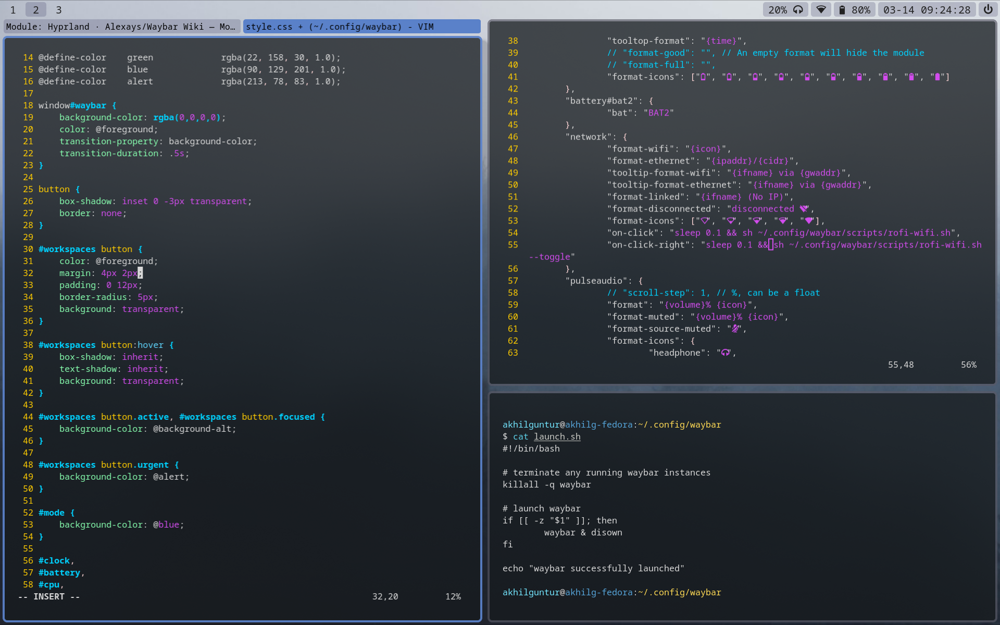
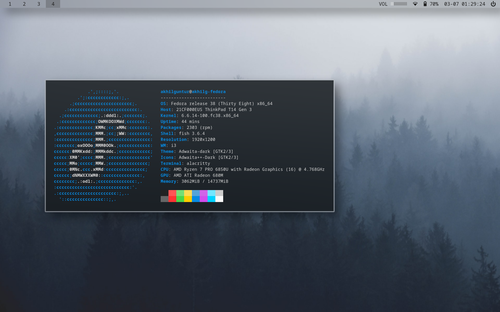

# dotfiles
These are the dotfiles I use on my installation of Fedora Linux

    
    

## Components
- wm: Hyprland
- icons: Adwaita++ Dark
- file manager: Thunar
- status bar: Waybar
- terminal emulator: Alacritty
- notification daemon: Dunst

## Custom Scripts

### switch-to

`switch-to`

Switches focus to the next window of the active window's class

### run-or-raise

`run-or-raise <program class>`

Based on [this post](https://www.willharris.dev/garden/run-or-raise) by Will Harris

Checks if a window of the given program class is open. If true, `switch-to` that program. Otherwise, open the program.

