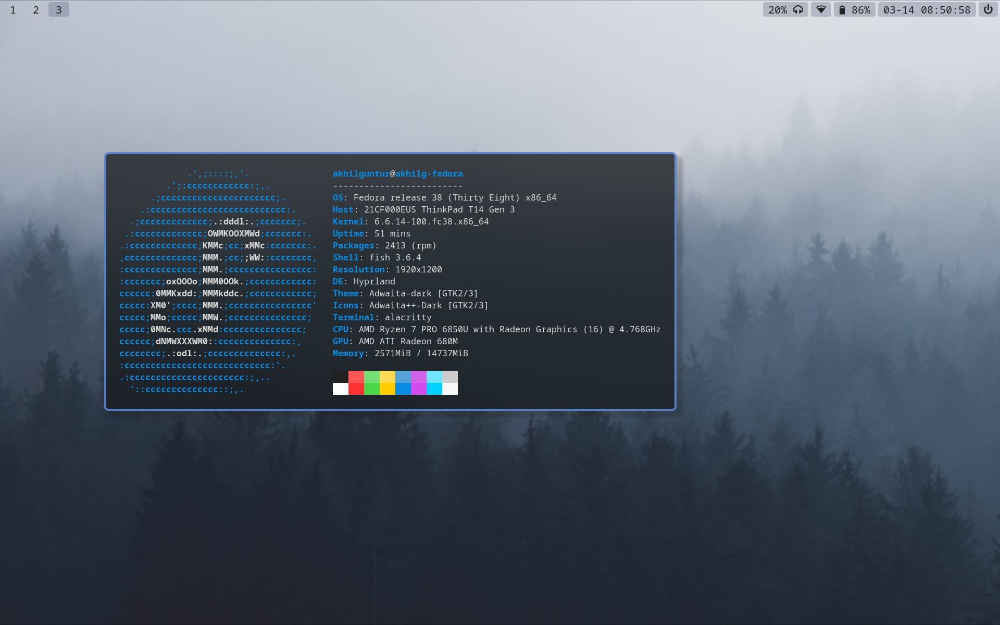

# dotfiles
These are the dotfiles I use on my installation of Fedora Linux

    
    

## Components
- wm: i3-gaps
- icons: Adwaita++ Dark
- file manager: Thunar
- status bar: Polybar
- terminal emulator: Alacritty
- notification daemon: Dunst

